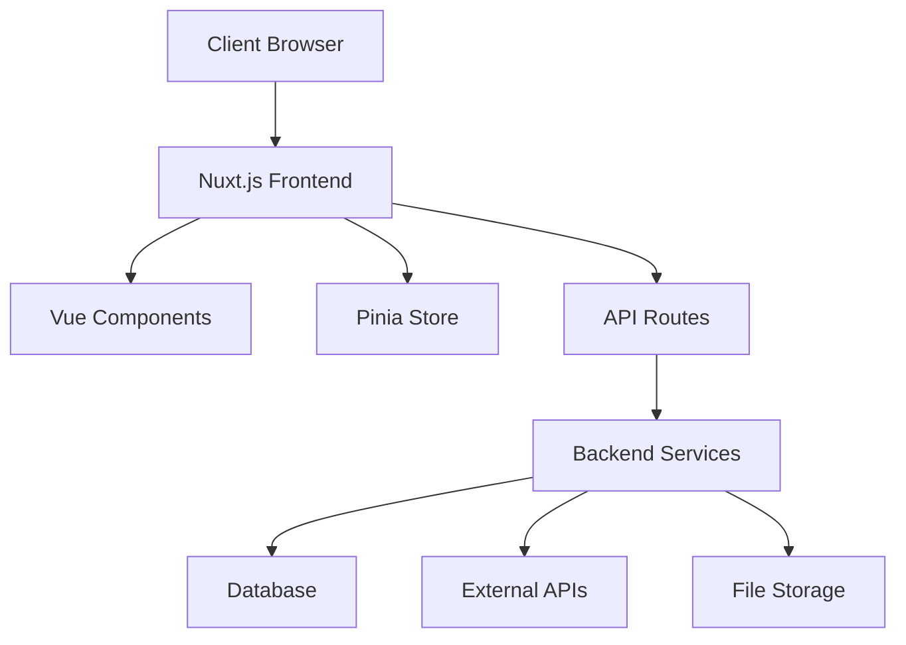
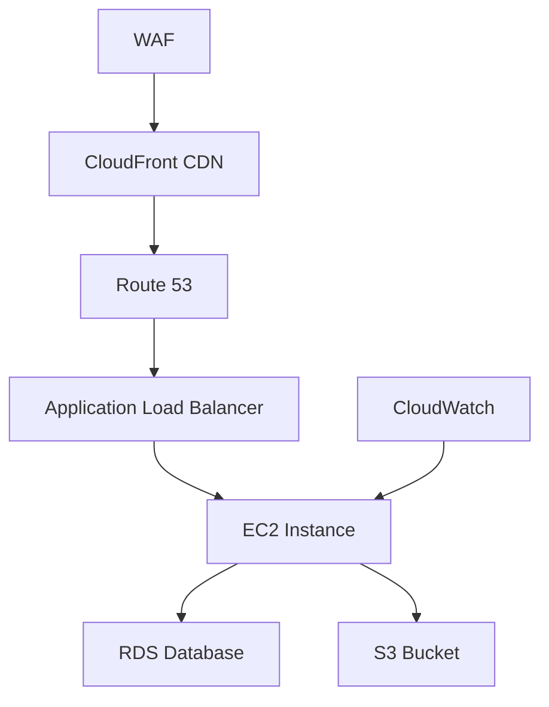
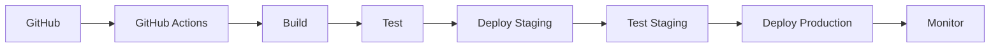
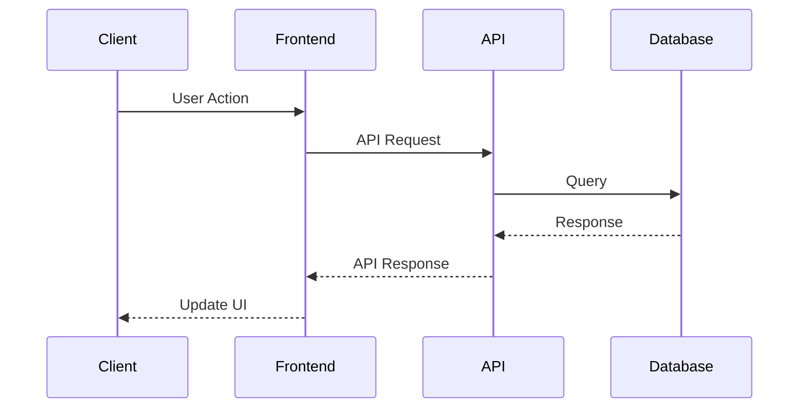
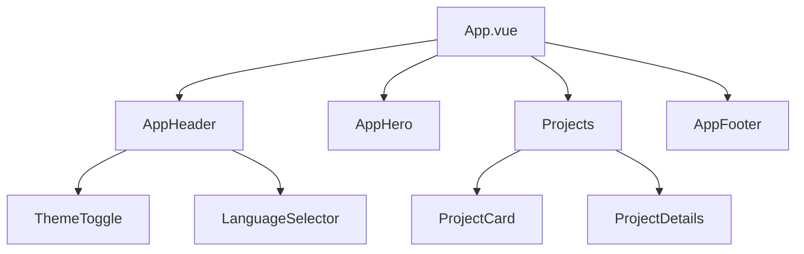
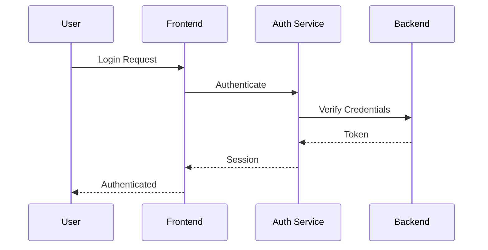
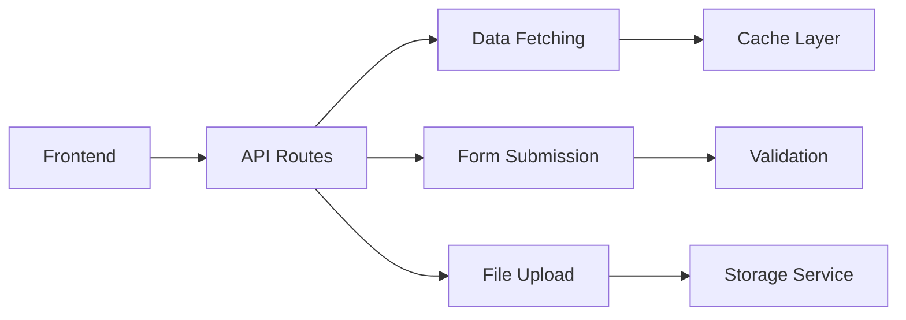
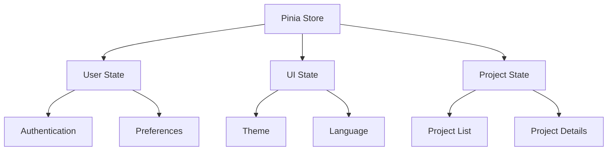
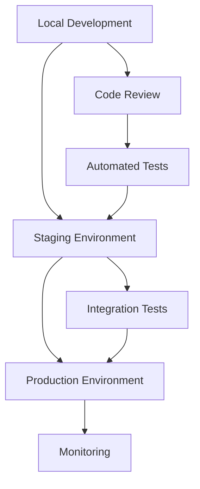
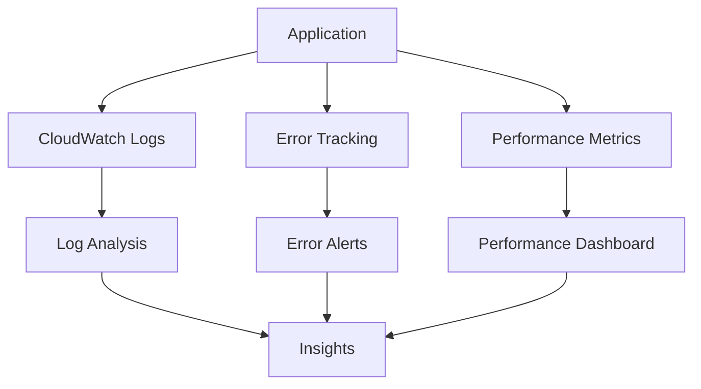

# Application Diagrams

## 1. Application Architecture


## 2. Infrastructure Setup


## 3. CI/CD Pipeline


## 4. Data Flow


## 5. Component Structure


## 6. Authentication Flow


## 7. API Integration


## 8. State Management


## 9. Deployment Process


## 10. Monitoring and Logging


These diagrams provide a visual representation of various aspects of your application, from the high-level architecture to specific flows and processes. They can be used for documentation, planning, and communication purposes.

Note: These diagrams are created using Mermaid.js syntax and can be rendered in any Markdown viewer that supports Mermaid diagrams.

# Infrastructure Diagrams

## 1. CloudFront & S3 Static Hosting Setup
```
                          ┌───────────────┐
                          │   Route 53    │
                          │  (DNS)        │
                          └───────┬───────┘
                                  │
                                  │ A/AAAA Records
                                  ▼
┌─────────────────┐      ┌───────────────┐     ┌────────────────┐
│ ACM Certificate │◄─────│   CloudFront  │────►│ S3 Bucket      │
│ (SSL/TLS)       │      │ Distribution  │     │ (Static Files) │
└─────────────────┘      └───────────────┘     └────────────────┘
                                  ▲
                                  │
                                  │
                   ┌──────────────┴──────────────┐
                   │                             │
           ┌───────────────┐             ┌───────────────┐
           │  volcode.org  │             │staging.volcode│
           │ www.volcode.org│             │    .org      │
           └───────────────┘             └───────────────┘
               Production                     Staging
```

## 2. Error Handling & Redirects
```
┌─────────────────────────────────────────────────────────┐
│                    CloudFront Distribution               │
└───────────────┬───────────────────────────────┬─────────┘
                │                               │
                ▼                               ▼
┌─────────────────────────┐         ┌─────────────────────────┐
│      Error Pages        │         │     Custom Origins      │
│                         │         │                         │
│ 404 ─► /404.html       │         │ S3 Bucket (Static)      │
│ 403 ─► /403.html       │         │ Lambda@Edge Functions   │
│ 500 ─► /500.html       │         │                         │
└─────────────────────────┘         └─────────────────────────┘
                │                               │
                │                               │
                ▼                               ▼
┌─────────────────────────┐         ┌─────────────────────────┐
│    S3 Error Handling    │         │    Origin Response      │
│                         │         │                         │
│ - Custom error pages    │         │ - Cache Control Headers │
│ - Redirect rules        │         │ - Security Headers      │
│ - CORS configuration    │         │ - Compression           │
└─────────────────────────┘         └─────────────────────────┘
```

## 3. Security & WAF Configuration
```
┌─────────────────────────────────────────────────────────┐
│                    Web Application Firewall (WAF)        │
└───────────────┬───────────────────────────────┬─────────┘
                │                               │
                ▼                               ▼
┌─────────────────────────┐         ┌─────────────────────────┐
│     WAF Rules          │         │     Rate Limiting       │
│                         │         │                         │
│ - SQL Injection        │         │ - Request Count         │
│ - XSS Protection       │         │ - IP Reputation         │
│ - Bad Bots             │         │ - Geographic Rules      │
└─────────────────────────┘         └─────────────────────────┘
                │                               │
                │                               │
                ▼                               ▼
┌─────────────────────────┐         ┌─────────────────────────┐
│    Security Headers     │         │    DDoS Protection      │
│                         │         │                         │
│ - CSP                   │         │ - AWS Shield            │
│ - HSTS                  │         │ - Auto Scaling          │
│ - X-Frame-Options       │         │ - Health Checks         │
└─────────────────────────┘         └─────────────────────────┘
```

## 4. CI/CD Pipeline with GitHub Actions
```
┌─────────────────────────────────────────────────────────┐
│                    GitHub Repository                     │
└───────────────┬───────────────────────────────┬─────────┘
                │                               │
                ▼                               ▼
┌─────────────────────────┐         ┌─────────────────────────┐
│     Build Process       │         │     Test Process        │
│                         │         │                         │
│ - Install Dependencies  │         │ - Unit Tests            │
│ - Build Assets          │         │ - Linting               │
│ - Optimize Images       │         │ - Type Checking         │
└─────────────────────────┘         └─────────────────────────┘
                │                               │
                │                               │
                ▼                               ▼
┌─────────────────────────┐         ┌─────────────────────────┐
│     Deployment          │         │     Verification        │
│                         │         │                         │
│ - S3 Sync               │         │ - Health Checks         │
│ - Cache Invalidation    │         │ - Smoke Tests           │
│ - CloudFront Update     │         │ - Performance Tests     │
└─────────────────────────┘         └─────────────────────────┘
```

## 5. Monitoring & Logging Architecture
```
┌─────────────────────────────────────────────────────────┐
│                    CloudWatch Logs                       │
└───────────────┬───────────────────────────────┬─────────┘
                │                               │
                ▼                               ▼
┌─────────────────────────┐         ┌─────────────────────────┐
│     Metrics Collection  │         │     Log Processing      │
│                         │         │                         │
│ - Request Count         │         │ - Error Logs            │
│ - Latency              │         │ - Access Logs           │
│ - Error Rates          │         │ - Performance Logs      │
└─────────────────────────┘         └─────────────────────────┘
                │                               │
                │                               │
                ▼                               ▼
┌─────────────────────────┐         ┌─────────────────────────┐
│     Alerts & Actions    │         │     Analytics           │
│                         │         │                         │
│ - Error Notifications   │         │ - Traffic Patterns      │
│ - Auto Scaling          │         │ - User Behavior         │
│ - Performance Alerts    │         │ - Conversion Rates      │
└─────────────────────────┘         └─────────────────────────┘
```

These diagrams provide a detailed view of your infrastructure setup, focusing on:
1. The core CloudFront and S3 static hosting configuration
2. Error handling and redirects setup
3. Security and WAF configuration
4. CI/CD pipeline implementation
5. Monitoring and logging architecture

Each diagram uses ASCII art to clearly show the relationships between different components and services. The diagrams are particularly focused on infrastructure aspects like error handling (404/403), security configurations, and deployment processes. 